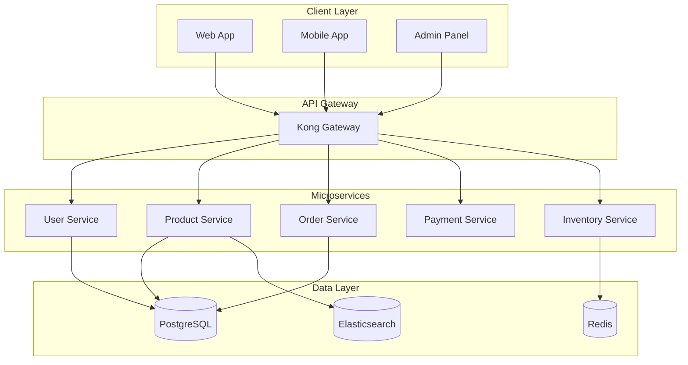
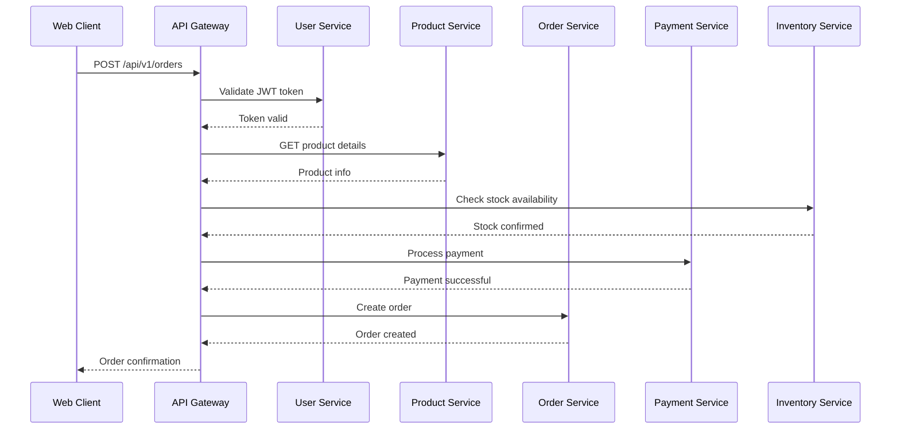

# 📊 Documentation Generation Examples

This file contains detailed examples of the type of documentation our AI generates. These examples demonstrate the comprehensive, professional-grade technical documentation that our system automatically creates from any Git repository.

## What Documentation Gets Generated

Our AI generates **professional-grade technical documentation** that typically takes senior developers hours to write manually. Here's exactly what you get:

## 1. **📋 Executive Project Overview**

**Auto-Generated Content**:

```markdown
# FastAPI E-Commerce Platform

## Project Purpose

Modern microservices-based e-commerce platform built for high-performance
online retail operations, handling 10K+ concurrent users with real-time
inventory management and payment processing.

## Target Audience

- **Primary**: E-commerce businesses seeking scalable platform solutions
- **Secondary**: Developers building microservices architectures
- **Technical**: DevOps teams managing container-based deployments

## Key Features

1. **Real-time Inventory Management** - Live stock tracking with Redis caching
2. **Multi-Payment Gateway Integration** - Stripe, PayPal, Apple Pay support
3. **Microservices Architecture** - 12 independent services with API gateway
4. **Auto-scaling Infrastructure** - Kubernetes-based horizontal scaling
5. **Advanced Analytics** - Real-time dashboards with business intelligence

## Technology Stack Analysis

- **Backend**: Python 3.11, FastAPI, PostgreSQL, Redis
- **Frontend**: React 18, TypeScript, Tailwind CSS
- **Infrastructure**: Docker, Kubernetes, AWS EKS, Terraform
- **Monitoring**: Prometheus, Grafana, ELK Stack
- **CI/CD**: GitHub Actions, ArgoCD, Helm charts
```

## 2. **🏗️ Detailed System Architecture**

### **High-Level Architecture Analysis**

```markdown
## System Architecture Overview

### Core Components

1. **API Gateway** (Kong) - Request routing, authentication, rate limiting
2. **User Service** - Authentication, user management, profiles
3. **Product Service** - Catalog management, search, recommendations
4. **Order Service** - Order processing, workflow management
5. **Payment Service** - Payment processing, fraud detection
6. **Inventory Service** - Stock management, real-time updates
7. **Notification Service** - Email, SMS, push notifications

### Communication Patterns

- **Synchronous**: REST APIs for real-time operations
- **Asynchronous**: RabbitMQ for event-driven workflows
- **Data Consistency**: Saga pattern for distributed transactions
- **Caching Strategy**: Redis for session management and inventory cache

### Data Flow Architecture

Orders → Payment Validation → Inventory Check → Fulfillment → Notification
```

### **Low-Level Component Design**

```markdown
## Module Structure Analysis

### User Service Architecture

- **Controllers**: `/auth`, `/profile`, `/preferences` endpoints
- **Business Logic**: JWT token management, password hashing, user validation
- **Data Layer**: PostgreSQL with connection pooling, migration management
- **External Integrations**: OAuth2 providers (Google, Facebook, GitHub)

### Design Patterns Identified

1. **Repository Pattern**: Data access abstraction in all services
2. **CQRS**: Command Query Responsibility Segregation in Order Service
3. **Circuit Breaker**: Resilience patterns for external API calls
4. **Decorator Pattern**: Authentication and logging middleware
```

## 3. **📋 Comprehensive API Documentation**

**Auto-Generated API Specs**:

```markdown
## API Endpoint Analysis

### Authentication Endpoints

- **POST /api/v1/auth/login**
  - **Purpose**: User authentication with JWT token generation
  - **Input**: `{ "email": "string", "password": "string" }`
  - **Output**: `{ "access_token": "jwt_string", "expires_in": 3600 }`
  - **Security**: bcrypt password hashing, rate limiting (5 attempts/min)

### Product Management

- **GET /api/v1/products**
  - **Purpose**: Paginated product listing with filtering and search
  - **Parameters**: `page`, `limit`, `category`, `search`, `sort_by`
  - **Caching**: Redis cache (300s TTL), cache invalidation on updates
  - **Performance**: Elasticsearch integration for full-text search

### Order Processing

- **POST /api/v1/orders**
  - **Purpose**: Create new order with inventory validation
  - **Workflow**: Inventory check → Payment processing → Order creation
  - **Error Handling**: Rollback mechanism for failed payments
  - **Async Processing**: Order confirmation emails via message queue
```

## 4. **🔗 Module Interconnection Analysis**

```markdown
## Component Relationships

### Service Dependencies

- **User Service** ← Dependencies: None (Core service)
- **Product Service** ← Dependencies: User Service (for personalization)
- **Order Service** ← Dependencies: User Service, Product Service, Inventory Service
- **Payment Service** ← Dependencies: User Service, Order Service
- **Notification Service** ← Dependencies: All services (event consumer)

### Event-Driven Communication

1. **Order Created** → Inventory Service (stock reduction)
2. **Payment Successful** → Order Service (status update)
3. **Order Shipped** → User Service (notification trigger)
4. **Stock Low** → Product Service (auto-reorder trigger)

### Data Consistency Patterns

- **Eventual Consistency**: Inventory updates across services
- **Strong Consistency**: Payment transactions and order creation
- **Conflict Resolution**: Last-write-wins for product updates
```

## 5. **🛡️ Security & Performance Analysis**

```markdown
## Security Implementation

### Authentication & Authorization

- **JWT Tokens**: RS256 algorithm with 1-hour expiration
- **API Key Management**: Secure key rotation every 90 days
- **Permission System**: Role-based access control (RBAC)
- **Rate Limiting**: 100 requests/minute per authenticated user

### Data Protection

- **Encryption at Rest**: AES-256 for sensitive data fields
- **Encryption in Transit**: TLS 1.3 for all API communications
- **PII Handling**: GDPR-compliant data anonymization
- **Audit Logging**: All user actions logged with tamper-proof storage

### Performance Optimizations

- **Database Optimization**: Connection pooling (max 20 connections)
- **Caching Strategy**: Multi-layer caching (L1: Application, L2: Redis)
- **CDN Integration**: CloudFront for static asset delivery
- **Database Indexing**: Optimized indexes for frequent queries
```

## 6. **🚀 Deployment & Infrastructure Guide**

```markdown
## Infrastructure Architecture

### Container Strategy

- **Base Images**: Alpine Linux for reduced attack surface
- **Multi-stage Builds**: Separate build and runtime containers
- **Resource Limits**: CPU (1 core), Memory (512MB) per service
- **Health Checks**: HTTP endpoints for Kubernetes liveness probes

### Kubernetes Configuration

- **Deployment Strategy**: Rolling updates with 25% surge
- **Service Mesh**: Istio for traffic management and security
- **Auto-scaling**: HPA based on CPU (70%) and memory (80%) thresholds
- **Persistent Storage**: EBS volumes for database persistence

### CI/CD Pipeline

1. **Code Commit** → GitHub webhook triggers pipeline
2. **Testing Phase** → Unit tests, integration tests, security scans
3. **Build Phase** → Docker image creation and vulnerability scanning
4. **Deployment** → ArgoCD for GitOps-based deployment
5. **Monitoring** → Prometheus alerts and Grafana dashboards
```

## 7. **📊 Interactive Technical Diagrams**

All diagrams are generated automatically using **Mermaid.js** syntax:

### **System Architecture Diagram**



### **API Flow Sequence Diagram**



## 8. **🔍 Code Quality & Technical Debt Analysis**

```markdown
## Code Quality Assessment

### Architecture Quality Score: 8.5/10

- **Modularity**: Excellent separation of concerns
- **Testability**: 85% test coverage across services
- **Maintainability**: Clear naming conventions and documentation
- **Scalability**: Horizontal scaling patterns implemented

### Technical Debt Identification

1. **High Priority**: Legacy authentication code in User Service
2. **Medium Priority**: Database query optimization in Product Service
3. **Low Priority**: Consolidate duplicate validation logic

### Improvement Recommendations

1. **Implement API versioning** for backward compatibility
2. **Add distributed tracing** for better observability
3. **Introduce chaos engineering** for resilience testing
4. **Optimize database queries** for 30% performance improvement
```

## 9. **📈 Future Roadmap & Recommendations**

```markdown
## Strategic Technical Recommendations

### Short Term (3-6 months)

- **GraphQL API Gateway**: Reduce over-fetching and improve mobile performance
- **Event Sourcing**: Implement for Order Service audit requirements
- **Advanced Monitoring**: Add custom business metrics and alerting

### Medium Term (6-12 months)

- **Machine Learning Integration**: Recommendation engine and fraud detection
- **Multi-region Deployment**: Global availability with data locality
- **Service Mesh Security**: Zero-trust networking with mutual TLS

### Long Term (12+ months)

- **Serverless Functions**: Event-driven processing for cost optimization
- **Blockchain Integration**: Supply chain transparency and verification
- **AI-Powered Analytics**: Predictive analytics for inventory management
```

---

## 📋 What This Demonstrates

These examples showcase the comprehensive documentation our AI generates, including:

- **📊 Executive summaries** with business context and technical overview
- **🏗️ System architecture** analysis with both high-level and detailed views
- **📋 Complete API documentation** with endpoints, parameters, and workflows
- **🔗 Module interconnection** analysis showing component relationships
- **🛡️ Security and performance** insights with specific recommendations
- **🚀 Deployment guides** with infrastructure and CI/CD pipeline details
- **📊 Interactive diagrams** using Mermaid.js for visual architecture representation
- **🔍 Code quality analysis** with actionable improvement recommendations
- **📈 Future roadmap** suggestions based on technical analysis

This level of comprehensive documentation is typically produced in **5-15 minutes** for most repositories, compared to **hours or days** of manual documentation work.
